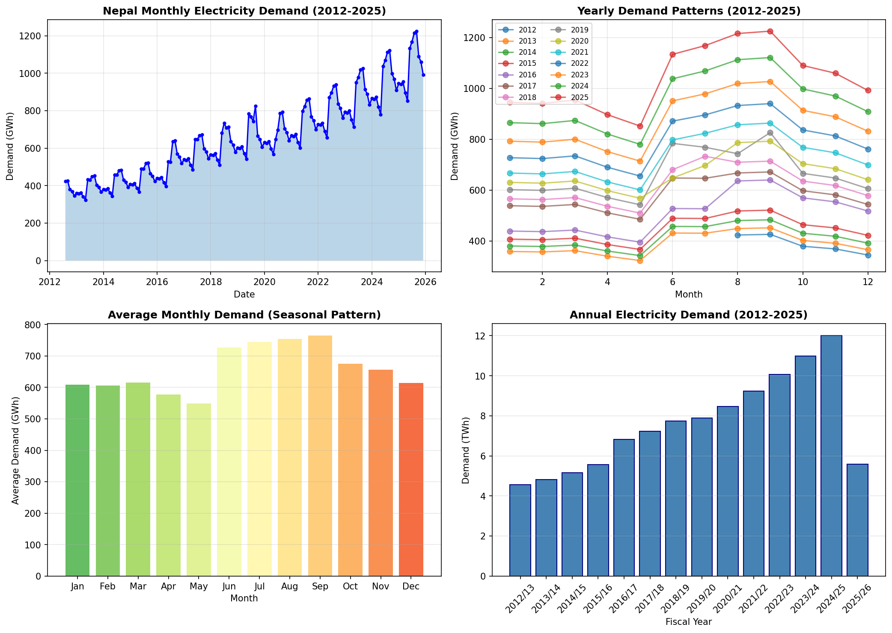
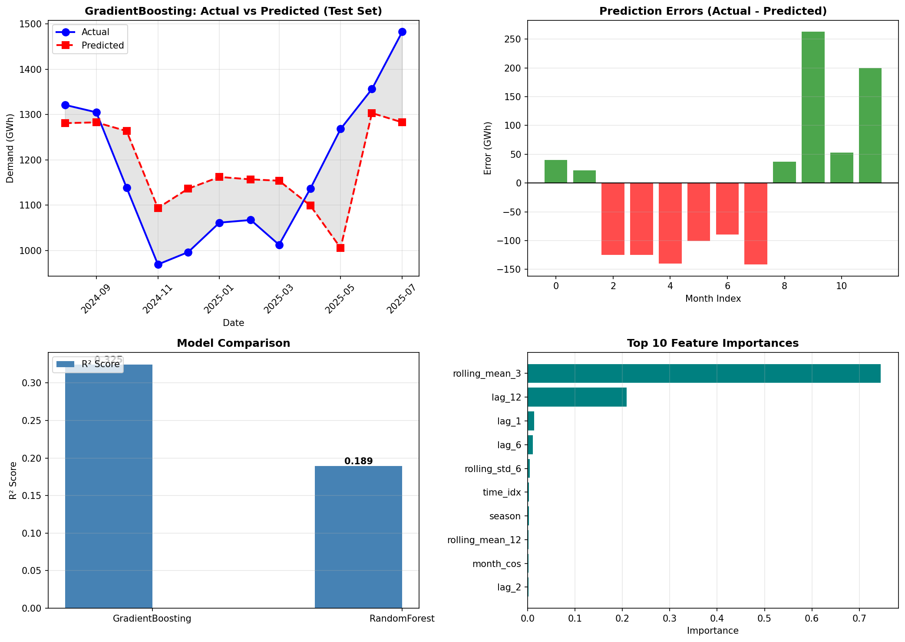
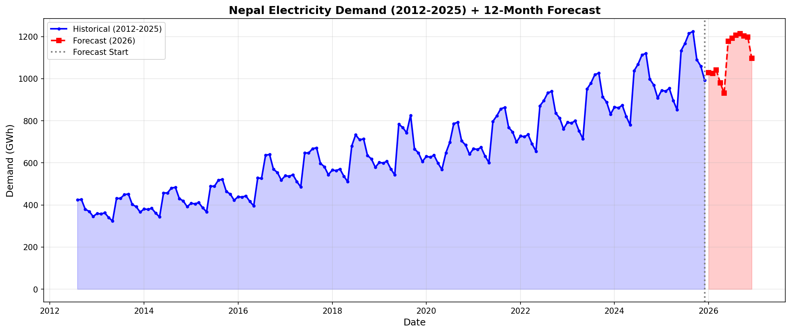

# URJA AI - Final Project

This project forecasts Nepal's monthly electricity demand (GWh) from historical data and serves the results in a Flask web interface.

The goal is practical forecasting with reproducible training and clear model reporting.

Author: Subodh

## Overview

URJA AI includes:

- A trained model under `models/nepal_2025/`
- A Flask app (`app.py`) with dashboard and API endpoints
- A retraining script (`retrain_model.py`) to regenerate artifacts
- Historical monthly demand data in `data/nepal_electricity_demand.csv`

## Visual Outputs

These charts are generated from the same model version used by the app.

### Demand Analysis



### Training Results



### Forecast Plot



## Dataset

- Source: Nepal Electricity Authority (compiled monthly demand records)
- Coverage: August 2012 to December 2025
- Frequency: Monthly
- Rows: 161
- Main file: `data/nepal_electricity_demand.csv`

## Model Performance (Current, Real Values)

The web dashboard and this README use the same metrics from `models/nepal_2025/metrics.json`.

| Metric | Value |
|---|---:|
| R2 | 81.02% |
| MAPE | 3.64% |
| MAE | 40.64 GWh |
| RMSE | 52.97 GWh |
| Train Samples | 149 |
| Test Samples | 12 |

Evaluation note: these values are based on a holdout test set (last 12 months), which is stricter than earlier optimistic reporting.

## How the App Works

1. `app.py` loads the latest versioned model folder (`models/nepal_*`).
2. The app reads model/scalers/config and serves historical data.
3. Forecasts are generated recursively for the selected horizon (6, 12, or 24 months).
4. Frontend requests metrics, history, and forecast through API endpoints.

## API Endpoints

| Endpoint | Method | Purpose |
|---|---|---|
| `/` | GET | Dashboard UI |
| `/api/status` | GET | Model/data loading status |
| `/api/metrics` | GET | Performance metrics |
| `/api/historical?months=36` | GET | Historical demand series |
| `/api/forecast?months=12` | GET | Forecast for selected horizon |
| `/api/annual` | GET | Annual demand totals |

## Local Setup

```bash
python -m venv .venv
.venv\Scripts\activate
pip install -r requirements.txt
python app.py
```

Then open `http://localhost:5000`.

## Retraining

Run:

```bash
python retrain_model.py
```

This refreshes artifacts like model weights, scalers, config, metrics, and forecast outputs in the versioned model directory.

## Project Structure

```text
final_project/
├── app.py
├── retrain_model.py
├── retrain_model.ipynb
├── requirements.txt
├── README.md
├── DEVLOG.md
├── data/
│   └── nepal_electricity_demand.csv
├── models/
│   └── nepal_2025/
│       ├── nepal_load_forecast_model.joblib
│       ├── scaler_X.pkl
│       ├── scaler_y.pkl
│       ├── config.json
│       ├── metrics.json
│       ├── forecast_12months.csv
│       ├── demand_analysis.png
│       ├── training_results.png
│       └── forecast_plot.png
└── templates/
  └── index.html
```

## Limitations and Next Steps

Current limitations:

- No prediction intervals are shown yet.
- The dashboard shows one model version at a time.
- Comparison against baseline models is not displayed.

Planned improvements:

- Add uncertainty bands to forecast output.
- Add rolling time-based validation summary in UI.
- Add model comparison view.

## License

MIT. See `LICENSE`.
